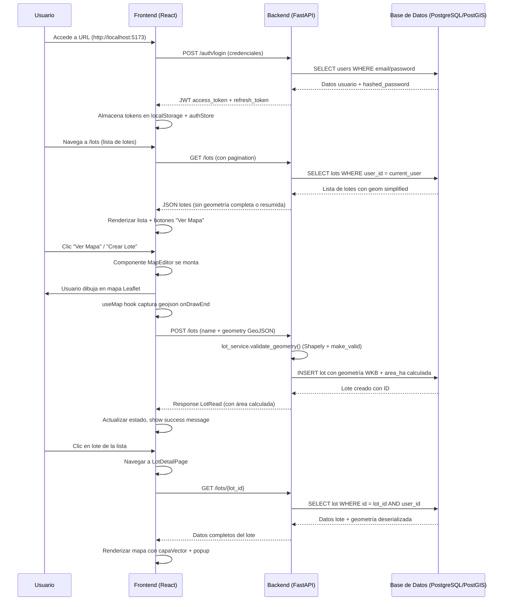

# Arquitectura del Sistema - GeoForraje 1.0

## 🏗️ Descripción General

```mermaid
graph TD
    %% Frontend
    subgraph FE["Frontend (React + TypeScript)"]
        direction TB
        A[App.tsx] --> B[Router (React Router v6)]
        B --> C[Modules]
        C --> C1[Auth Module]
        C --> C2[Lots Module]
        C --> C3[Map Module]
        C --> C4[Dashboard Module]
        style FE fill:#e3f2fd,stroke:#1976d2,stroke-width:2px
    end

    %% Backend
    subgraph BE["Backend (FastAPI + Python)"]
        direction TB
        D[Main App] --> E[Routers]
        D --> F[Core]
        D --> G[Services]
        D --> H[Schemas]
        D --> I[DB]
        style BE fill:#fff3e0,stroke:#fb8c00,stroke-width:2px
    end

    %% Components within Backend
    E --> E1["auth.py /auth endpoints"]
    E --> E2["lots.py /lots endpoints"]
    E --> E3["health.py /health endpoint"]
    F --> F1["config.py configuración"]
    F --> F2["security.py JWT + bcrypt"]
    F --> F3["database.py engine + session"]
    G --> G1["lot_service.py negocio lotes"]
    G --> G2["geometry_service.py validación geometría"]
    H --> H1["auth.py esquemas auth"]
    H --> H2["lot.py esquemas lotes"]
    I --> I1["PostgreSQL + PostGIS"]

    style E1 fill:#c8e6c9,stroke:#388e3c,stroke-width:1px
    style E2 fill:#c8e6c9,stroke:#388e3c,stroke-width:1px
    style E3 fill:#c8e6c9,stroke:#388e3c,stroke-width:1px

    %% Database
    subgraph DB["PostgreSQL + PostGIS"]
        direction LR
        I1 --> I2["users table"]
        I1 --> I3["lots table"]
        I1 --> I4["analyses table"]
        style DB fill:#e8f5e9,stroke:#2e7d32,stroke-width:2px
    end

    %% Styles
    classDef frontend fill:#e3f2fd,color:#1565c0,font-weight:bold;
    classDef backend fill:#fff3e0,color:#e65100,font-weight:bold;
    classDef database fill:#e8f5e9,color:#2e7d32,font-weight:bold;
    classDef service fill:#f1f8e9,color:#33691e,font-weight:bold;
```

### 1. Capas del Sistema

#### Frontend (Capa de Presentación)
- **Tecnologías**: React 18, TypeScript, Vite, Tailwind CSS
- **Estado Global**: Zustand (authStore), TanStack Query (serverside state)
- **Ruteo**: React Router v6 con rutas protegidas (`PrivateLayout`)
- **Componentes**: 
  - `AuthModule`: Login, Register, ProtectedRoute
  - `LotsModule`: LotsPage, LotFormPage, LotDetailPage
  - `MapModule`: MapView, MapEditor, VectorLayer, DrawControl, BaseLayers, useMap hook
  - `DashboardModule`: DashboardPage (accesible tras login)

#### Backend (Capa de Lógica)
- **Tecnologías**: FastAPI 0.110+, Python 3.11, SQLModel, Pydantic
- **API REST**: Documentación automática en `/docs` (Swagger) y `/openapi.json`
- **Autenticación**: JWT HS256 con `python-jose`, bcrypt para passwords via `passlib`
- **Base de Datos**: PostgreSQL 15 + PostGIS extensión para datos geoespaciales
- **ORM**: SQLModel (sobre SQLAlchemy async), migraciones con Alembic

#### Base de Datos (Capa de Persistencia)
- **Sistema**: PostgreSQL 15 con extensión PostGIS (geometría espacial)
- **Modelos**: SQLModel (`User`, `Lot`, `Analysis`)
- **Espacial**: Funciones PostGIS `ST_GeomFromGeoJSON`, `ST_AsGeoJSON`, `ST_Transform`, `ST_Area`
- **Migraciones**: Alembic con control de versiones (fases 1-5 definidas)

#### DevOps (Capa de Despliegue)
- **Containerización**: Docker Compose (desarrollo), Dockerfile + Nginx + Gunicorn (producción)
- **Orchestration**: `make up` (levantar todos los servicios), `make down` (apagar), `make build` (build producción)
- **Monitoreo**: Health check `/health`, métricas Prometheus en `/metrics`
- **SSL**: Nginx reverse proxy con Let's Encrypt (producción)

### 2. Flujo de Datos Principales



### 3. Arquitectura de Seguridad

```mermaid
graph LR
    subgraph "Flujo de Autenticación"
        U[Usuario] -->|Credenciales| FE[Frontend]
        FE->>BE[Backend FastAPI] POST /auth/login
        BE->>BE[Valida credenciales] JWT HS256
        BE-->>FE[Frontend] access_token + refresh_token
        FE->>FE[localStorage] Almacena tokens
        FE->>FE[authStore Zustand] Actualiza estado global
        
        %% Protección de rutas
        FE-->>BE[Verifica token] GET /auth/me
        BE-->>BE[Decodifica JWT] Verifica firma + expiración + type=access
        BE-->>FE[Frontend] UserPublic data
        
        %% Refresh automático
        FE->>BE[POST /auth/refresh] Rotación token
        BE-->>FE[Frontend] Nuevos tokens (old invalidated)
        
        %% Logout
        FE->>BE[POST /auth/logout] Limpiar sesión
        BE-->>FE[Frontend] Tokens removidos + redirect /login
    end
    
    %% Middleware FastAPI
    BE-->>BE[Middleware CORSMiddleware] origens permitidas
    BE-->>BE[Middleware JWT Auth] type=access, usuario activo
```

### 4. Despliegue y Entorno

#### Entorno Desarrollo (`make up`)
```mermaid
graph LR
    subgraph "Servicios Levantados"
        D1[Frontend (Vite + React)] :5173
        D2[Backend (FastAPI)] :8000
        D3[PostgreSQL + PostGIS] :5432
        D4[pgAdmin] :5050
    end
    D1 <-->|API calls| D2
    D2 <-->|SQL queries| D3
    style Desarrollo fill:#e3f2fd,stroke:#1976d2,stroke-width:2px
```

#### Entorno Producción (`docker-compose.prod.yml`)
```mermaid
graph LR
    subgraph "Producción con Nginx"
        P1[Frontend (servido por Nginx estático)] :80
        P2[Backend (Gunicorn + Uvicorn workers)] :8000
        P3[PostgreSQL + PostGIS] :5432
        P4[Nginx Reverse Proxy + SSL (Let's Encrypt)] :443
    end
    P1 <-->|HTTPS| P4
    P2 <-->|HTTP| P4
    style Producción fill:#ffeb3b,stroke:#f57f17,stroke-width:2px
```

### 5. Decisiones de Arquitectura

| Decisión | Justificación |
|----------|---------------|
| **FastAPI + SQLModel** | Rendimiento alto, autodoc Swagger, tipado fuerte, async nativo |
| **PostgreSQL + PostGIS** | Estándar de industria para geoespaciales, relaciones robustas, extensiones maduras |
| **JWT sobre sesiones** | Stateless (no requiere servidor de sessions), escalable, mobile-friendly |
| **React + Vite** | Hot reload instantáneo, bundles pequeños, mejor DX (Developer Experience) |
| **Leaflet vs Google Maps** | Sin costos de licencia, totalmente personalizable, offline-capable con tiles propios |
| **Docker Compose** | Desarrollo unificado, mismos imágenes que producción, fácil onboarding |
| **Alembic migraciones** | Control de esquema BD, rollbacks posibles, versionado tipo código |

### 6. Posibles Mejoras Futuras (Fase 5)

| Mejora | Impacto | Esfuerzo |
|--------|---------|----------|
| **Google Earth Engine integration** | Capas raster satelitales actualizadas automáticamente | Alto |
| **Microservicios** | Separar análisis y mapa en servicios independientes | Medio |
| **Multi-tenant** | Múltiples usuarios organizados por organización | Medio |
| **WebSockets** | Actualizaciones en tiempo real de análisis | Bajo |
| **Caching layer** | Redis para tokens sesiones frecuentes | Bajo |

## 📐 Diagrama de Dependencias

```mermaid
graph TD
    U[Usuario] -->|usa| FE[Frontend React]
    FE -->|consume| BE[Backend FastAPI]
    BE -->|usa| BD[PostgreSQL/PostGIS]
    
    FE -->|usa| Zustand(authStore)
    FE -->|usa| TanStack Query
    FE -->|usa| Leaflet + draw.pm
    BE -->|usa| SQLModel
    BE -->|usa| Pydantic schemas
    BE -->|usa| Alembic migrations
    BE -->|usa| python-jose (JWT)
    BE -->|usa| passlib (bcrypt)
    BE -->|usa| shapely (geometría)
    BE -->|usa| pyproj (transformaciones CRS)
```

## 🎯 Resumen Arquitectónico

| Aspecto | Decisión | Razón |
|---------|----------|-------|
| **Arquitectura** | Cliente-Servidor REST | Simple, escalable, conocido |
| **Estado** | Stateless enBackend (JWT) | Escalable horizontalmente |
| **Persistencia** | PostgreSQL + PostGIS | Estándar geoespacial, robusto |
| **Frontend** | React + TypeScript + Vite | Modern, fast, good ecosystem |
| **Mapas** | Leaflet + draw.pm | Sin licencias, personalizable |
| **Autenticación** | JWT HS256 | Stateless, industry standard |
| **Despliegue** | Docker Compose + Nginx | Unificado dev/prod, fácil deploy |

---

**📝 Nota**: Esta arquitectura soporta las 4 fases implementadas (Fase 1-4) y es extensible para la Fase 5 (análisis raster y despliegue avanzado).